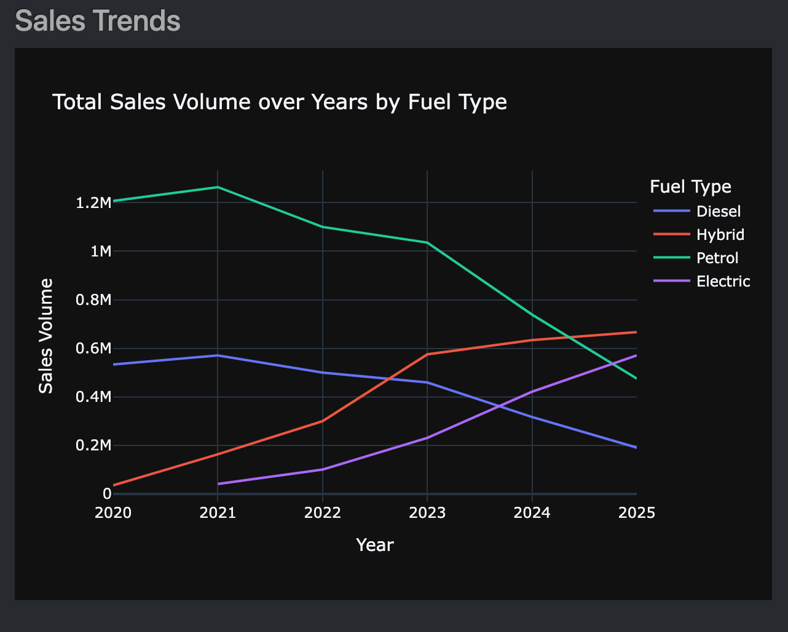
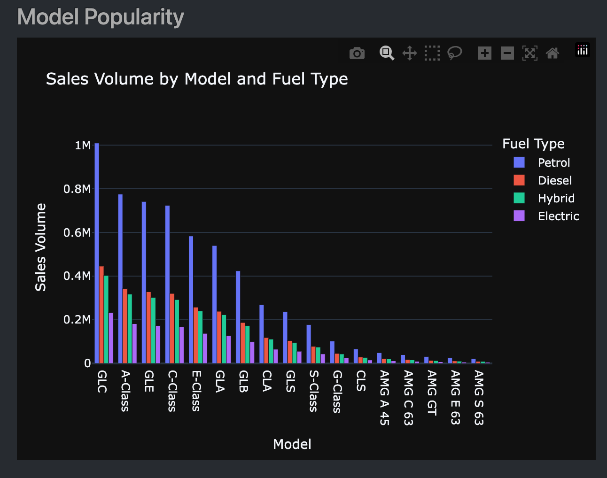
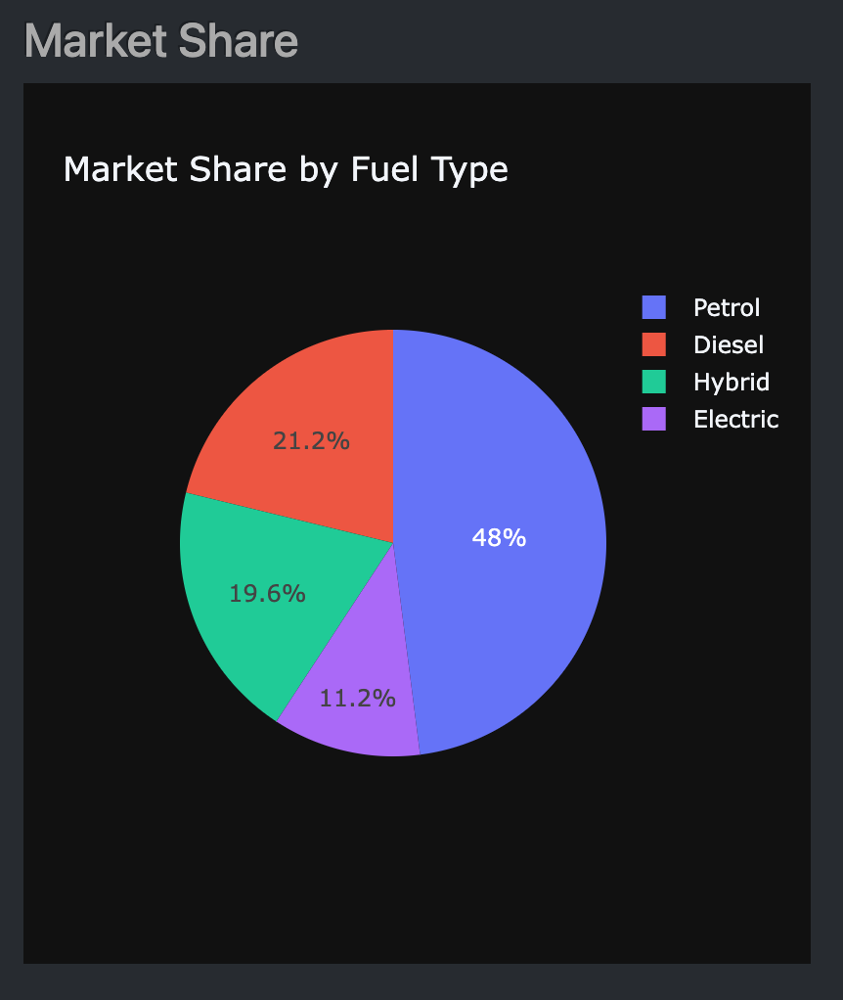
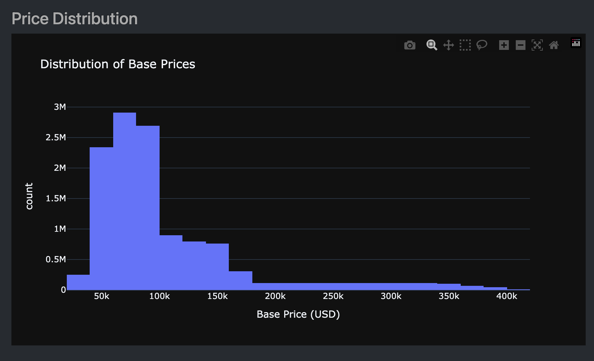
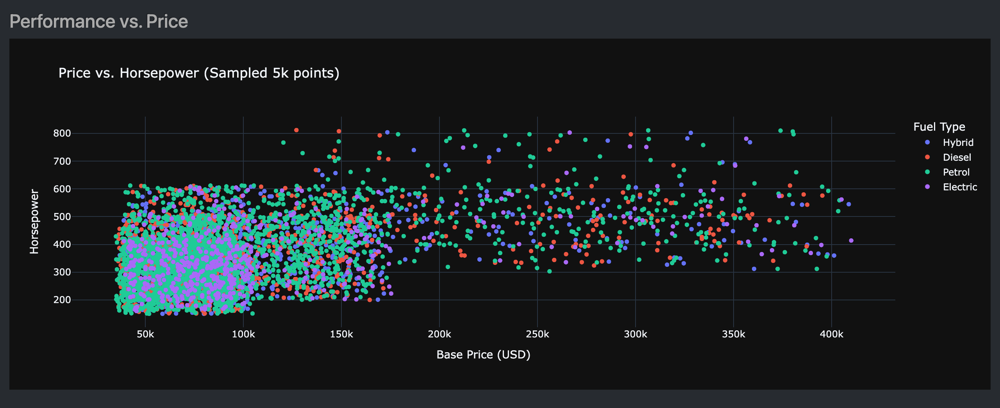
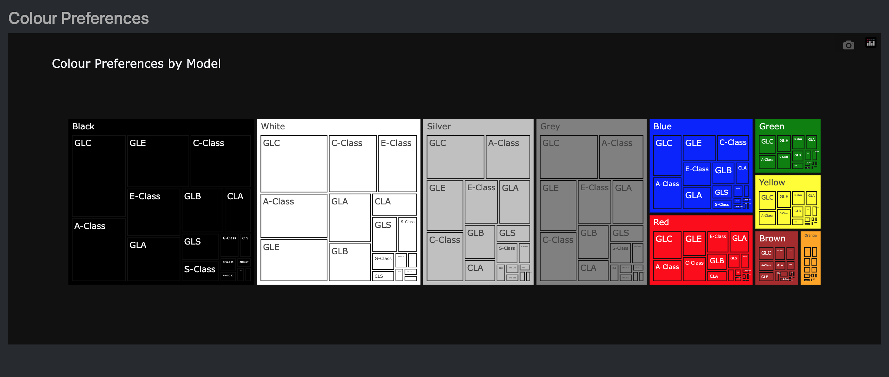
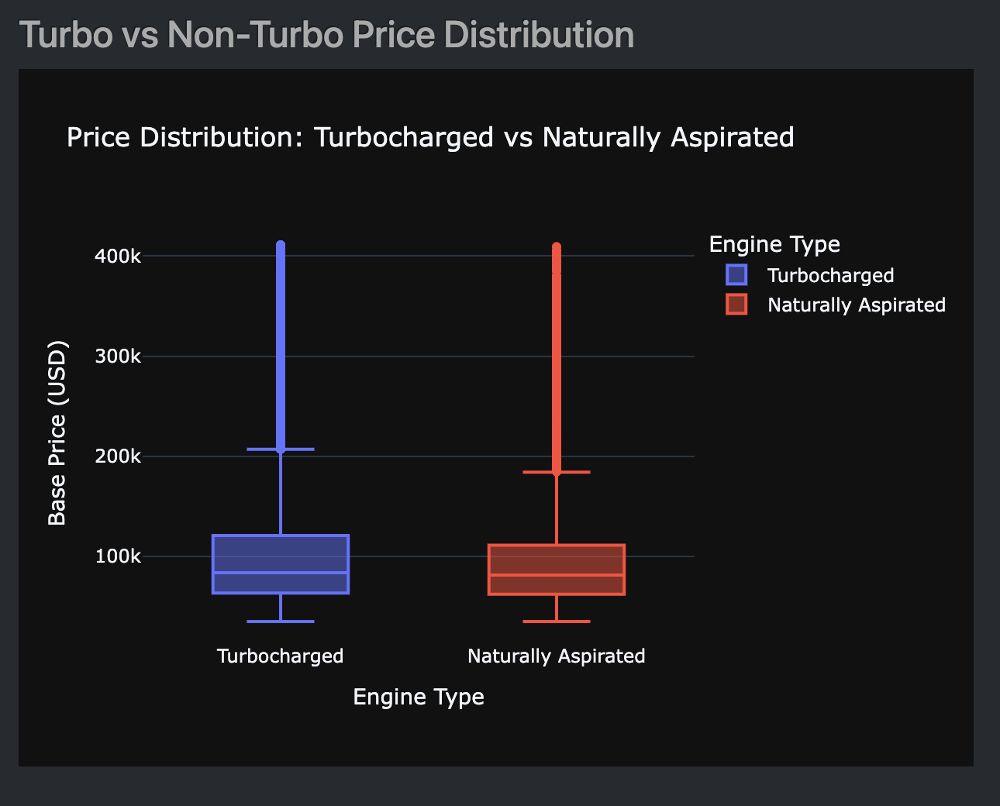
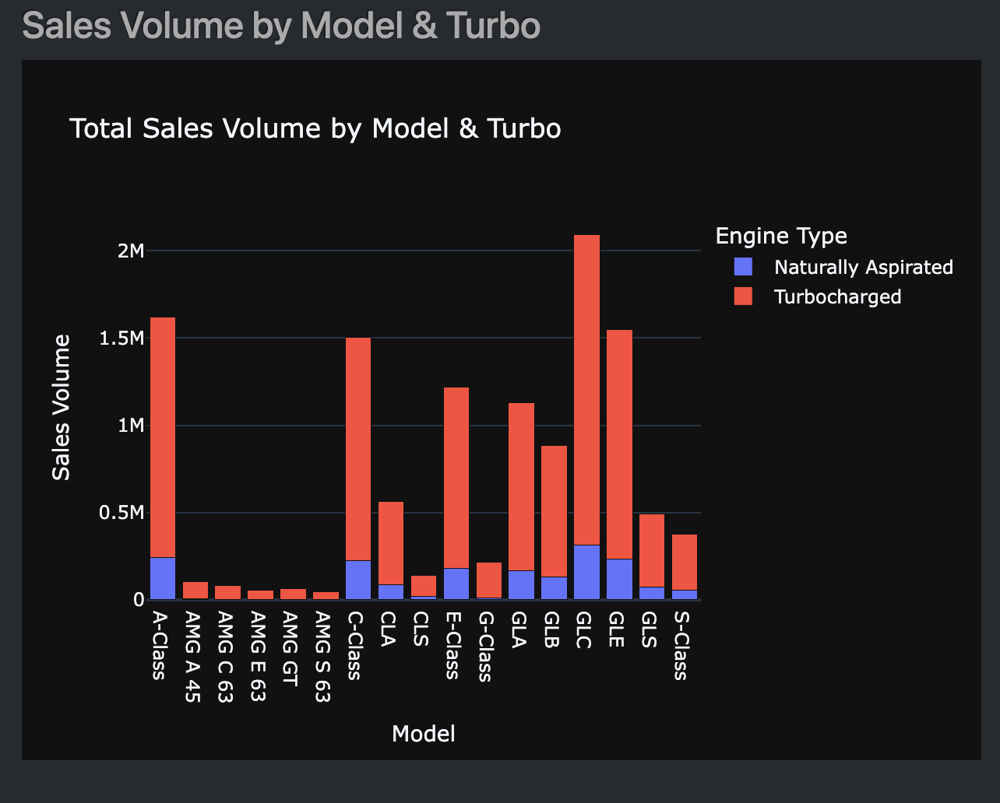
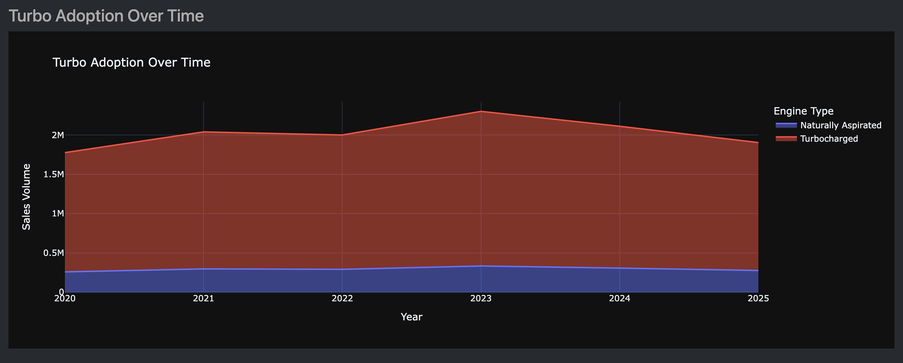

# Mercedes-Benz Sales Dashboard (2020-2025)


An end-to-end data analytics project focused on the global sales performance of Mercedes-Benz. This repository contains the tools and visualizations necessary to transform raw transactional data into actionable business insights regarding automotive market trends.

## Dashboard Preview (Streamlit)
See the dashboard in action:
[Mercedes-Benz Sales Dashboard](https://mercedes-sales-dashboard.streamlit.app/)
* Apply filters to explore specific segments of the market.
* Explore the evolution of sales over time.
* Visualize the impact of various features on vehicle price.

##  Project Overview
The automotive industry is undergoing a massive shift towards sustainability and high-tech performance. This dashboard explores how Mercedes-Benz has navigated this period, covering the post-pandemic recovery (2020) through the projected electrification surge of 2025.

### Key Insights Tracked:
* **Sales Volume:** Analysis of the ~1.8 million units sold over a 5-year period.
* **Market Segmentation:** Performance breakdown by Model (A-Class to G-Class) and Body Style.
* **Electrification:** Growth of EV/Hybrid market share from near 0% in 2020 to ~30% by 2025.
* **Feature Preference:** Distribution of Horsepower, Turbocharged engines, and Color preferences (Black/White dominance).

##  Dataset Information
The analysis is based on the [Mercedes Global Car Sales 2020-2025](https://www.kaggle.com/datasets/dhrubangtalukdar/mercedes-global-car-sales-2020-2025) dataset.

| Column           | Description                                               |
|:-----------------|:----------------------------------------------------------|
| **Model**        | Specific Mercedes-Benz model name (e.g., GLC, AMG S 63)   |
| **Year**         | Year of sale (2020 – 2025)                                |
| **Fuel Type**    | Powertrain (Petrol, Diesel, Hybrid, Electric)             |
| **Base Price**   | Retail price in USD (adjusted for ~3.5% annual inflation) |
| **Horsepower**   | Engine power output                                       |
| **Color**        | Vehicle paint color preferences                           |
| **Sales Volume** | Transactional count (1 per row)                           |
| **Turbo**        | Engine induction (Turbocharged or Naturally Aspirated)    |

##  Getting Started

### Prerequisites
* [Python, Dash/Plotly, Streamlit]
* Download the dataset from Kaggle via the link above.

### Installation & Execution
Follow these steps to set up the environment and process the data before launching the dashboard:

1. Clone the repository:
   ```bash
   git clone [https://github.com/radebeneo/mercedes_sales_dashboard.git](https://github.com/radebeneo/mercedes_sales_dashboard.git)
   
2. Setup and activate your Python environment:
   ```bash
   # Windows
   python -m venv venv
   .\venv\Scripts\activate

   # macOS/Linux
   python3 -m venv venv
   source venv/bin/activate
   
3. Install dependencies:
   ```bash
   pip install -r requirements.txt

4. Prepare the Data:
* Download the dataset from Kaggle.
* Place the mercedes_benz_sales_2020_2025.csv file directly in the root folder.

5. Convert to Parquet:
* Run this script to convert the large CSV into a more efficient, lower file size format:
   ```bash
   python csv_to_parquet.py
  
6. Aggregate Data:
* Run this script next to aggregate your data before generating visuals:
   ```bash
   python shrink_data.py
   
7. Launch the Dashboard:
* Run the following command to render the dashboard to your local browser:
   ```bash
   python dashboard.py
  

### Visual Analysis Gallery
<table style="width:100%">
<tr>
<th>Sales by Fuel Type </th>
<th>Top Performing Models</th>
</tr>
<tr>
<td></td>
<td></td>
</tr>
<tr>
<th>Marker Share by Fuel Type</th>
<th>Distribution of Prices</th>
</tr>
<tr>
<td></td>
<td></td>
</tr>
</table>

<table style="width:100%">
<tr>
<th>Vehicle Price Based on Performance</th>
</tr>
<tr>
<td></td>
</tr>
<tr>
<th>Color Preferences by Model</th>
</tr>
<tr>
<td></td>
</tr>
</table>

<table style="width:100%">
<tr>
<th>Price Distribution by Induction</th>
<th>Sales by Model & Induction</th>
</tr>
<tr>
<td></td>
<td></td>
</tr>
</table>

<table style="width:100%">
<tr>
<th>Turbo Adoption Over Time</th>
</tr>
<tr>
<td></td>  
</tr>
</table>

### Built With
* Pandas & PyArrow: Data manipulation and Parquet optimization.
* Plotly/Dash: Interactive data visualization framework.
* Kaggle: Primary data source provider.

Disclaimer: This project uses a synthetic dataset designed to mirror real-world automotive trends for educational and analytical purposes.